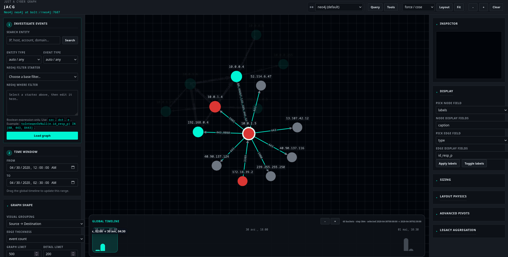

# JACG - Just a Cyber Graph


PoC for graph visualisation of investigation data. Has been mainly tried on zeek.

Import JSONL logs into Neo4j for advanced visualisation.

## Requirements

- Docker
- Docker Compose
- Python 3

## Installation

```bash
python3 -m venv .venv
source .venv/bin/activate
pip install -r requirements.txt
docker compose up -d
```

## Quick Usage

```bash
python3 zeek_jsonl_to_neo4j.py --preview zeek/logs/conn.jsonl
python3 zeek_jsonl_to_neo4j.py --dry-run zeek/logs/conn.jsonl
python3 zeek_jsonl_to_neo4j.py zeek/logs/conn.jsonl
```

## Generate a Config

```bash
python3 zeek_jsonl_to_neo4j.py --init-config zeek_neo4j_config.example.json
python3 zeek_jsonl_to_neo4j.py --config zeek_neo4j_config.example.json --dry-run
```

## Timestamp

Supported formats:

```text
none
epoch_float
epoch_int
iso
python
```

Zeek example:

```json
{
  "timestamp_enabled": true,
  "timestamp_field": "ts",
  "timestamp_format": "epoch_float",
  "timestamp_timezone": "UTC"
}
```

Python format example:

```json
{
  "timestamp_enabled": true,
  "timestamp_field": "timestamp",
  "timestamp_format": "python",
  "timestamp_python_format": "%Y-%m-%d %H:%M:%S",
  "timestamp_timezone": "Europe/Paris"
}
```

## Structure

```text
zeek_jsonl_to_neo4j.py              Entrypoint
zeek_neo4j_importer/
  cli.py                            CLI arguments
  config.py                         JSON config + .env
  defaults.py                       Default config
  identifiers.py                    Labels, properties, Cypher identifiers
  jsonl.py                          JSONL reading, flattening, preview
  timeparse.py                      Timestamp parsing
  model.py                          Record -> Neo4j row transformation
  cypher.py                         Cypher fragments
  neo4j_client.py                   Connection, constraints, import, delete
  interactive.py                    Interactive configuration
```

## Delete an Import

```bash
python3 zeek_jsonl_to_neo4j.py --config zeek_neo4j_config.example.json --delete-import
```

## Graph Explorer

The explorer uses live physics only for graphs small enough to remain
interactive. Larger graphs automatically fall back to a static scalable layout
and show a lightweight warning in the graph canvas instead of blocking the UI.


## Netgraph Profiles

Profiles are stored in:

```text
netgraph_profiles/*.json
```

They save and reload log mappings, for example:

```text
conn_profile.json   IP -> ConnEvent -> IP
dns_profile.json    IP -> DnsEvent -> Domain
http_profile.json   IP -> HttpEvent -> Host/URI
ssl_profile.json    IP -> SslEvent -> ServerName
```

Migrate older profiles to the `Source -> Event -> Destination` model:

```bash
python3 zeek_jsonl_to_neo4j.py --migrate-profiles
```

During interactive configuration, the script can load an existing profile and save the current mapping as a profile.

Imported relationships keep the profile provenance:

```text
profile_name    Last/current profile used for this relationship
profile_names   Deduplicated list of profiles that imported this relationship
```

Profile names are stored on relationships rather than entity nodes so the same
node can be reused by several profiles without mixing node identity with import
provenance.

## Manual Cypher Examples

Use these in **Manual Cypher** with parameters such as:

```json
{
  "min_neighbors": 5,
  "max_neighbors": 20,
  "limit": 500
}
```

### Clients With X-Y Servers

Find source/client nodes that talk to between `min_neighbors` and `max_neighbors` distinct destinations. Results stay aggregated by source and destination.

```cypher
MATCH (client:Entity)-[:SRC_OF]->(e)-[:DST_TO]->(server:Entity)
WITH client, count(DISTINCT server) AS neighbor_count
WHERE neighbor_count >= $min_neighbors AND neighbor_count <= $max_neighbors
MATCH (client)-[:SRC_OF]->(e)-[:DST_TO]->(server:Entity)
WITH client, server, neighbor_count, count(e) AS event_count,
     sum(coalesce(toFloat(e.orig_bytes), 0) + coalesce(toFloat(e.resp_bytes), 0)) AS total_bytes,
     sum(coalesce(toFloat(e.orig_bytes), 0)) AS source_bytes,
     sum(coalesce(toFloat(e.resp_bytes), 0)) AS destination_bytes,
     min(e.ts_datetime) AS first_seen,
     max(e.ts_datetime) AS last_seen
RETURN
  coalesce(client.caption, client.display, client.value, elementId(client)) AS source,
  coalesce(server.caption, server.display, server.value, elementId(server)) AS target,
  labels(client)[0] AS source_label,
  labels(server)[0] AS target_label,
  neighbor_count,
  event_count,
  total_bytes,
  source_bytes,
  destination_bytes,
  first_seen,
  last_seen
ORDER BY neighbor_count DESC, event_count DESC, total_bytes DESC
LIMIT $limit
```

### Servers With X-Y Clients

Find destination/server nodes reached by between `min_neighbors` and `max_neighbors` distinct sources. Results stay aggregated by source and destination.

```cypher
MATCH (client:Entity)-[:SRC_OF]->(e)-[:DST_TO]->(server:Entity)
WITH server, count(DISTINCT client) AS neighbor_count
WHERE neighbor_count >= $min_neighbors AND neighbor_count <= $max_neighbors
MATCH (client:Entity)-[:SRC_OF]->(e)-[:DST_TO]->(server)
WITH client, server, neighbor_count, count(e) AS event_count,
     sum(coalesce(toFloat(e.orig_bytes), 0) + coalesce(toFloat(e.resp_bytes), 0)) AS total_bytes,
     sum(coalesce(toFloat(e.orig_bytes), 0)) AS source_bytes,
     sum(coalesce(toFloat(e.resp_bytes), 0)) AS destination_bytes,
     min(e.ts_datetime) AS first_seen,
     max(e.ts_datetime) AS last_seen
RETURN
  coalesce(client.caption, client.display, client.value, elementId(client)) AS source,
  coalesce(server.caption, server.display, server.value, elementId(server)) AS target,
  labels(client)[0] AS source_label,
  labels(server)[0] AS target_label,
  neighbor_count,
  event_count,
  total_bytes,
  source_bytes,
  destination_bytes,
  first_seen,
  last_seen
ORDER BY neighbor_count DESC, event_count DESC, total_bytes DESC
LIMIT $limit
```
